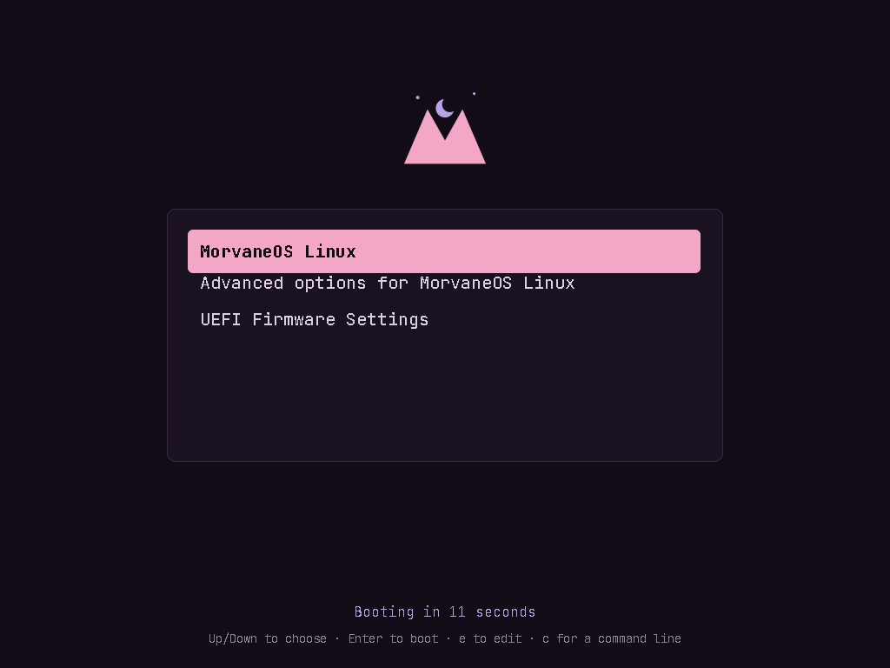

# morvane-grub-theme

The MorvaneOS GRUB theme: **Twilight Peaks** on night, the boot list in a
rounded panel, the selected entry in pastel pink.



*Real GRUB, rendered in QEMU at 1024×768.*

## Where it's used

- **The live ISO:** artools' `buildiso` copies `/usr/share/grub/themes/artix`
  into every ISO, so this package installs the theme there too and replaces
  Artix's `artix-grub-theme`. The ISO's boot menu
  (`iso-profiles/morvane/live-overlay/usr/share/grub/cfg/grub.cfg` in
  MorvaneOS-Linux) loads it.
- **Installed systems:** the MorvaneOS installer installs this package, copies
  the theme to `/boot/grub/themes/morvane` and sets `GRUB_THEME` to it. The copy
  is there because GRUB can't read `/usr` at boot when the root partition is
  encrypted; `morvane-grub-theme.hook` keeps it updated when this package
  changes.

## Changing the theme

Everything in `theme/` is generated. Edit `tools/build.py` (colours, layout,
fonts, the `theme.txt` template), then:

```
python tools/build.py [path/to/morvane-assets]
```

Needs Python with `fonttools` and `pillow`, plus `rsvg-convert` and
`grub-mkfont`. The logo comes from [MorvaneOS/assets](https://github.com/MorvaneOS/assets)
(default `~/projects/morvane-assets`). Commit the regenerated `theme/`, bump
`pkgver` or `pkgrel`, then build and publish as usual.

GRUB fonts are bitmaps at fixed sizes (`.pf2`). To use another size, add it to
`FONTS` in `tools/build.py` and refer to it in the template by its full name,
e.g. `"JetBrains Mono Regular 24"`.

To try a theme on an installed system without rebuilding the package: copy
`theme/` over `/boot/grub/themes/morvane/` and reboot. No `grub-mkconfig`
needed unless you add fonts.

## License

See `LICENSE`. The bundled fonts are JetBrains Mono under the SIL Open Font
License (`OFL.txt`).
